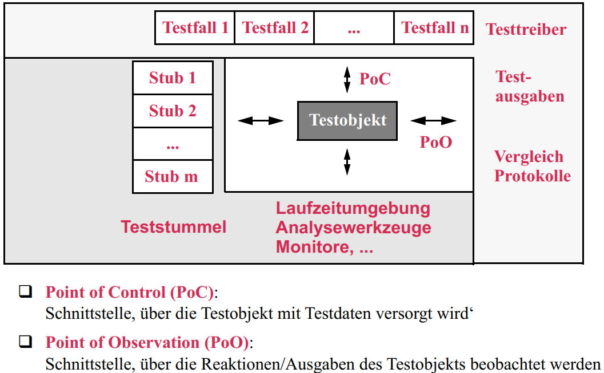
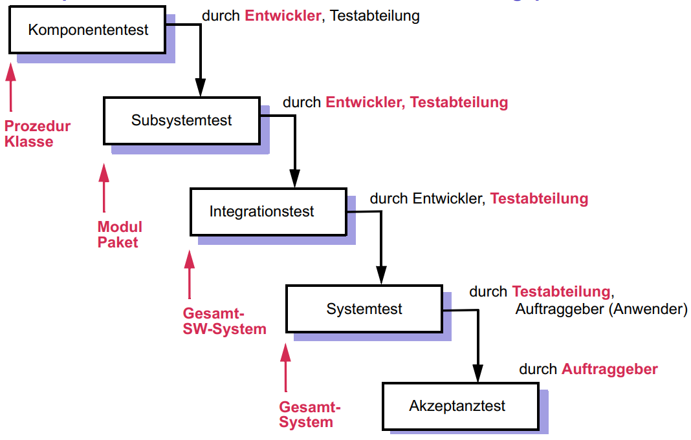
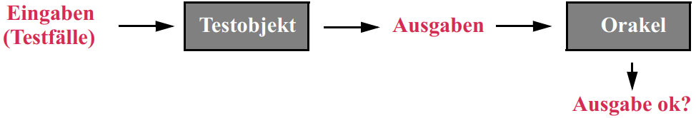
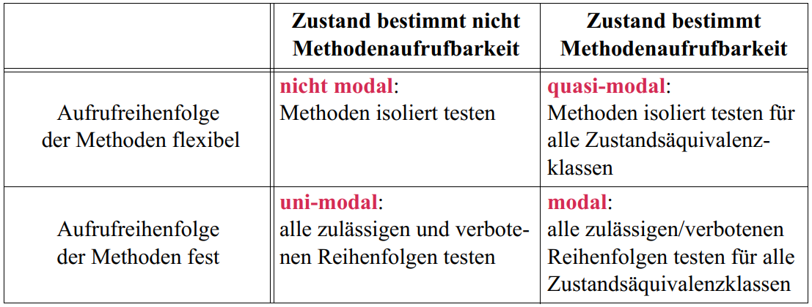
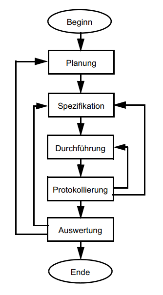

# Table of Content
<!-- TOC -->

- [Table of Content](#table-of-content)
- [1. SW-Entwicklung, -Wartung & (Re-)Engineering](#1-sw-entwicklung--wartung--re-engineering)
  - [1.2 SW-Qualität](#12-sw-qualität)
  - [1.3 Iterative SW-Entwicklung](#13-iterative-sw-entwicklung)
  - [1.4 Forward-, Reverse- und Reengineering](#14-forward--reverse--und-reengineering)
- [2. Konfigurationsmanagement](#2-konfigurationsmanagement)
  - [2.1 Einleitung](#21-einleitung)
  - [2.2 Versionsmanagement](#22-versionsmanagement)
      - [Source Code Control System (SCCS)](#source-code-control-system-sccs)
      - [Revision Control System (RCS)](#revision-control-system-rcs)
      - [Concurrent Version System (CVS)](#concurrent-version-system-cvs)
      - [Subversion (SVN)](#subversion-svn)
      - [Prinzipien echt verteilter Versionierungs-Systeme (Git)](#prinzipien-echt-verteilter-versionierungs-systeme-git)
  - [2.3 Variantenmanagement (SW-Produktlinien)](#23-variantenmanagement-sw-produktlinien)
  - [2.4 Releasemanagement](#24-releasemanagement)
      - [Planungsprozess für neues Release](#planungsprozess-für-neues-release)
  - [2.5 Buildmanagement](#25-buildmanagement)
  - [2.6 Änderungsmanagement](#26-änderungsmanagement)
- [3. Statische Programmanalye & Metriken](#3-statische-programmanalye--metriken)
  - [3.1 Einleitung](#31-einleitung)
      - [Arten der statischen Programmanalyse](#arten-der-statischen-programmanalyse)
  - [3.2 Softwarearchitekturen und -visualisierung](#32-softwarearchitekturen-und--visualisierung)
  - [3.3 Reviews](#33-reviews)
  - [3.4 Kontroll- und Datenflussorientierte Analysen](#34-kontroll--und-datenflussorientierte-analysen)
      - [Gerichteter Graph](#gerichteter-graph)
      - [Kontrollflussgraph](#kontrollflussgraph)
      - [Datenflussgraph](#datenflussgraph)
      - [Abhängigkeitsgraph](#abhängigkeitsgraph)
      - [Datenfluss- und Kontrollflussanomalien](#datenfluss--und-kontrollflussanomalien)
      - [Undefined-Reference-Datenflussanomalie](#undefined-reference-datenflussanomalie)
      - [Defined-Defined-Datenflussanomalie](#defined-defined-datenflussanomalie)
      - [Defined-Undefined-Datenflussanomalie](#defined-undefined-datenflussanomalie)
  - [3.5 Softwaremetriken](#35-softwaremetriken)
      - [Lines of Code (LoC)](#lines-of-code-loc)
      - [Zyklomatische Zahl nach McCabe](#zyklomatische-zahl-nach-mccabe)
      - [Live Variables](#live-variables)
      - [Variablenspanne](#variablenspanne)
      - [Metriken für OO-Programme](#metriken-für-oo-programme)
      - [Low Cohesion Metric (LOCOM1)](#low-cohesion-metric-locom1)
      - [Low Cohesion Metric (LOCOM2)](#low-cohesion-metric-locom2)
      - [Afferent Coupling (AC)](#afferent-coupling-ac)
      - [Efferent Coupling (EC)](#efferent-coupling-ec)
      - [Instabilität (I)](#instabilität-i)
- [4. Dynamische Programmanalysen und Testen](#4-dynamische-programmanalysen-und-testen)
  - [4.1 Einleitung](#41-einleitung)
      - [Fehlerzustand, Fehlerwirkung und Fehlhandlung](#fehlerzustand-fehlerwirkung-und-fehlhandlung)
      - [Typische Programmierfehler](#typische-programmierfehler)
      - [Aufbau eines Testrahmens](#aufbau-eines-testrahmens)
      - [Was wird getestet?](#was-wird-getestet)
      - [Wie wird getestet?](#wie-wird-getestet)
      - [Testprozess](#testprozess)
      - [Integrationsteststrategien](#integrationsteststrategien)
      - [Systemtest](#systemtest)
      - [Die sieben Grundsätze des Testens](#die-sieben-grundsätze-des-testens)
  - [4.2 Laufzeit- und Speicherplatzverbrauchsmessungen](#42-laufzeit--und-speicherplatzverbrauchsmessungen)
  - [4.3 Funktionsorientierte Testverfahren (Black Box Testing)](#43-funktionsorientierte-testverfahren-black-box-testing)
  - [4.4 Kontrollflussbasierte Testverfahren (White Box Testing)](#44-kontrollflussbasierte-testverfahren-white-box-testing)
  - [4.5 Datenflussbasierte Testverfahren](#45-datenflussbasierte-testverfahren)
  - [4.6 Testen von OO-Programmen](#46-testen-von-oo-programmen)
      - [Tabellarische Übersicht über verschiedene Arten von Klassen beim Testen](#tabellarische-übersicht-über-verschiedene-arten-von-klassen-beim-testen)
      - [Checkliste für Klassentests](#checkliste-für-klassentests)
  - [4.7 Mutationsbasierte Testverfahren](#47-mutationsbasierte-testverfahren)
  - [4.8 Testmanagement und Testwerkzeuge](#48-testmanagement-und-testwerkzeuge)
      - [Aufgaben, Qualifikationen und Rollen](#aufgaben-qualifikationen-und-rollen)
      - [Weitere Aspekte des Testmanagements](#weitere-aspekte-des-testmanagements)
- [5. Management der Software-Entwicklung](#5-management-der-software-entwicklung)

<!-- /TOC -->

# 1. SW-Entwicklung, -Wartung & (Re-)Engineering

## 1.2 SW-Qualität

- Qualität ist der Grad, indem ein System die Kundenerwartungen und Kundenbedürfnisse erfüllt.
- **Qualitätsmerkmale**: Funktionalität
- **Nichtfunktionale Merkmale**:
  - Zuverlässigkeit
  - Benutzbarkeit
  - Effizienz
  - Änderbarkeit
  - Übertragbarkeit

- **Prinzipien der QS**:
  - Qualitätszielbestimmung
  - quantitative QS (z.B durch Metriken)
  - konstruktive QS
    - technische Maßnahmen (z.B. IDE, Sprache, Tools)
    - organisatorische Maßnahmen (z.B DoD, Guidelines, Standards)
  - analytische QS
    - analysierende Verfahren (z.B reviews, static analysis, formal verification)
    - testende Verfahren (z.B. dynamische Tests, symbolische Tests)
  - unabhängige QS (durch QA-Team)

## 1.3 Iterative SW-Entwicklung

**Wasserfallmodell** 

* Wasserfall ist **scheiße**, weil ...
    * strikte Phaseneinteilung ist unrealistisch
    * Anforderungen sind zu Beginn unklar und ändern sich ständig

**V-Modell** 

## 1.4 Forward-, Reverse- und Reengineering

Forward-Engineering 

Reverse-Engineering 

Reengineering 

# 2. Konfigurationsmanagement

## 2.1 Einleitung

* **KM-Planung**: Beschreibung der Standards, Verfahren, Tools
* **Versionsmanagement**: Verwaltung der Entwicklungsgeschichte (git)
* **Variantenmanagement**: Verwaltung parallel existierender Ausprägungen eines Produkts für verschiedene Anforderungen, Länder, Plattformen etc.
* **Releasemanagement**: Verwaltung und Planung von Auslieferungsständen
* **Buildmanagement**: Erzeugung des auszuliefernden Produkts
* **Änderungsmanagement**: Verwaltung von Feature Requests

**Integration des KMs im V-Modell** 

## 2.2 Versionsmanagement

#### Source Code Control System (SCCS)

* Je Dokument gibt es eine eigene History-Datei, die alle Revisionen als eine Liste jeweils geänderter Blöcke speichert.

* **Instruktionen zur Erzeugung von Deltas (SCCS)**
    * Die Anzahl der geänderten, gelöschten und neu erzeugten Zeilen aller Hunks eines Deltas zweier Dateien wird möglichst **klein gehalten**.
    * Jeder Hunk beginnt mit genau **einer** unveränderten **Kontextzeile** und enthält sonst nur geänderte, gelöschte oder neu eingefügte Zeilen (Ausnahme: Dateianfang).
    * Aufeinander folgende Hunks sind also durch jeweils **mindestens eine unveränderte Zeile** getrennt.
    * Optional: Anstelle von Löschen und Neuerzeugen einer Zeile `i` verwendet man die **Änderungsmarkierung** `"!"`
* SCCS ist nicht gut da **single write access** und **multiple read access**

#### Revision Control System (RCS)

* Je Dokument gibt es eine eigene History-Datei, die eine neueste Revision vollständig und andere Revisionen als Deltas speichert

* Problem: kein Konfigurationsbegriff und kein Variantenbegriff

#### Concurrent Version System (CVS)

* Reimplementierung von RCS
* merge-Konzept (merge-conflicts muss der Entwickler manuell beheben)
* Releasemanagement mit Hilfe von Tags
* Hilfsprogramme wie z.B. "cvsann" (wie eine git-blame annotation)
* Problem: 
    * keine Versionierung von Directories
    * zugeschnitten auf Textdateien
    * nicht gut für verteilte SW-Entwicklung

#### Subversion (SVN)

* löst die Probleme von CVS

#### Prinzipien echt verteilter Versionierungs-Systeme (Git)

* Jeder Entwickler hat ein lokales Repository
* `checkout`, `commit`, etc. arbeiten auf der lokalen Umgebung
* Austausch zwischen Repositories erfolgt mit `push` und `pull` per ssh oder http
* Bei Push/Pull werden parallele Revisionen angelegt, die dann mit `merge` zusammengeführt werden.

## 2.3 Variantenmanagement (SW-Produktlinien)

// TODO: wtf

## 2.4 Releasemanagement

* Festlegung der Funktionalität eines neuen Releases
* Festlegung des Zeitpunktes der Freigabe eines neuen Releases
* Erstellung und Verbreitung eines Releases
* Dokumentation des Releases

#### Planungsprozess für neues Release

* Vorbedingungen für neues Release werden überprüft
    * viel Zeit vergangen
    * viele Fehler behoben
    * viele neue Funktionen hinzugefügt
* Weiterentwicklung wird eingefroren
    * **Feature Freeze** (soft freeze)
        * nur noch Bug- und Smallfixes
    * **Code Freeze** (hard freeze)
        * nur noch absolut notwendige Änderungen
* Letzte Fehlerkorrekturen und Tests werden durchgeführt
* Release wird freigegeben und deployed
    * Weiterentwicklung neuer Releases wird aufgenommen
    * freigegebenes Release muss parallel dazu gepflegt werden

## 2.5 Buildmanagement

* Werkzeuge für Buildmanagement
    * make
    * Ant
    * gradle
    * Maven
    * Jenkins

## 2.6 Änderungsmanagement

Heute läuft es folgendermaßen ab:
* Der Kunde hat ein feature request und wenn dieser sinnvoll ist, ensteht ein JIRA Item. Dieser wird bearbeitet und bei Sprint-Ende released. Fertig.

# 3. Statische Programmanalye & Metriken

## 3.1 Einleitung

#### Arten der statischen Programmanalyse

* Visualisierung von Programmstrukturen
* Reviews
* Compilerprüfungen
* Programmverifikation und symbolische Ausführung
* Stilanalysen
* Kontroll- und Datenflussanalysen
* Metriken

## 3.2 Softwarearchitekturen und -visualisierung

* Ein SW-System besteht aus Teilsystemen, die zusammengehörige Gruppen von Diensten anbieten und möglichst unabhängig voneinander realisiert sind.
* Ein Teilsystem kann wiederum aus Teilsystemen aufgebaut werden, die aus Modulen (Packages) bestehen.
* Ein Modul (Package) bietet über seine Schnittstelle Dienste an und benutzt (importiert) zu ihrer Realisierung Dienste andere Module (Packages)
* Ein Modul fast "verwandte" Prozeduren, Klassen, ... zusammen

## 3.3 Reviews

* Inspektion
    * Reviewer begutachtet Code
* Technisches Review
    * weniger Aufwand wie Inspektion; ähnlicher Nutzen
* Informelles Review
    * Entwickler zeigt Code, Reviewer stellt Fragen
* Pair Programming
    * Review nicht nötig, da Reviewer im Pair mitenthalten ist

## 3.4 Kontroll- und Datenflussorientierte Analysen

#### Gerichteter Graph
* Ein gerichteter Graph `G` ist ein Tupel `(N, E)` mit
    * `N := Menge von Knoten`
    * `E := N x N` einer Menge gerichteter Kanten mit `e = (v1, v2)` wird Kante von `v_1` nach `v_2` genannt 

#### Kontrollflussgraph
* Ein Kontrollflussgraph eines Programms ist ein gerichteter Graph `G = (N, E, n_start, n_final)` mit
    * `N` ist die Menge der Anweisungen eines Programms
    * `E` ist die Menge der Zweige zwischen den Anweisungen des Programms
    * `n_start` ist der Startknoten
    * `n_final` ist der Endknoten
* Ein Pfad der Länge `k` in einem Kontrollflussgraphen `G` ist eine Knotenfolge `n_1, ..., n_k`
* Ein **zyklenfreier Pfad** enthält keinen Knoten zweimal
* Ein **Zyklus** ist ein Pfad mit `n_1 = n_k`
* Ein **Segment** eines Kontrollflussgraphen `G` ist ein Knoten `s` der einen Teilgraph `G'` von `G` ersetzt, der aus einem zyklenfreien Pfad besteht
* **Datenflussattribute**
    * `n` besitzt das Attribut `d(v)` falls `n` eine Zuweisung an `v` enthält
    * `n` besitzt das Attribut `c(v)` (compute) falls `n` eine Berechnung mit Zugriff auf `v` enthält
    * `n` besitzt das Attribut `p(v)` (predicative) falls `n` eine Fallentscheidung mit Zugriff auf `v` enthält
    * `n` besitzt das Attribut `r(v)` (reference) falls es das Attribut `c(v)` oder `p(v)` besitzt, also lesend auf `v` zugreift
    * `n` besitzt das Attribut `u(v)` falls `v` in dieser Anwendung (noch) keinen definierten Wert (mehr) besitzen kann

#### Datenflussgraph
* Ein Datenflussgraph `D = (V_d, E_d)` zu einem Kontrollflussgraphen G eines Programms besteht aus
    * einer Menge von Knoten `V_d` für alle Anweisungen `V` des Programms
    * einer Menge von Datenflusskanten `E_d`
        * `(n_1, n_2) := E_d` gdw. es einem Pfad `p` im Kontrollflussgraphen `G` von `n_1` nach `n_2` gibt, sodass für eine Variable `v` gilt
            * `d(v)` für `n_1`: Anweisung `n_1` definiert Wert für `v`
            * `r(v)` für `n_2`: Anweisung `n_2` benutze Wert von `v`
            * für alle Anweisungen `n` auf Pfad `p` (ohne `n_1`) gilt nicht `d(v)` für n

#### Abhängigkeitsgraph
* Ein Abhängigkeitsgraph `A = (N_a, E_a)` eines Programms ist ein gerichteter Graph, der
    * alle Knoten und Kanten des Datenflussgraphen enthält sowie zusätzlich
    * Kanten des Kontrollflussgraphen von allen Bedingungen zu direkt kontrollierten Anweisungen

#### Datenfluss- und Kontrollflussanomalien
* **Datenflussanomalien** sind
    * es gibt einen Pfad im Kontrollflussgraphen, auf dem eine Variable `v` referenziert wird, bevor sie zum ersten Mal definiert wird (Zugriff auf undefinierte Variable)
    * es gibt einen Pfad im Kontrollflussgraphen, auf dem eine Variable `v` zweimal definiert wird ohne zwischen den Definitionsstellen referenziert zu werden (nutzlose Zuweisung an Variable)
* **Kontrollflussanomalien** sind bei modernen Programiersprachen von geringerer Bedeutung. Im wesentlichen handelt es sich dabei bei Programmiersprachen ohne `goto` Anweisungen um nicht erreichbaren Code (ansonsten bspw. Sprünge in Schleifen hinein)

#### Undefined-Reference-Datenflussanomalie
* ur-Datenflussanomalie
    * es gibt einen segmentfreien Pfad `n_1, ... , n_k`
    * `n_1` hat Attribut `u(v)`
    * `n_2, ... , n_k-1` hat nicht Attribut `d(v)`
    * `n_k` hat Attribut `r(v)`

#### Defined-Defined-Datenflussanomalie
* dd-Datenflussanomalie
    * es gibt einen segmentfreien Pfad `n_1, ... , n_k`
    * `n_1` hat Attribut `d(v)`
    * `n_2, ... , n_k-1` hat nicht Attribut `[r|d|u](v)`
    * `n_k` hat Attribut `d(v)`

#### Defined-Undefined-Datenflussanomalie
* du-Datenflussanomalie
    * es gibt einen segmentfreien Pfad `n_1, ... , n_k`
    * `n_1` hat Attribut `d(v)`
    * `n_2, ... , n_k-1` hat nicht Attribut `[r|d|u](v)`
    * `n_k` hat Attribut `u(v)`

## 3.5 Softwaremetriken

* **Produktmetriken** messen Eigenschaften der SW
    * Qualität der SW (z.B. gefundene Bugs)
    * Einhaltung von Standards (z.B. verletzte Stilregeln)
* **Prozessmetriken** messen Eigenschaften des Entwicklungsprozesses
    * Dauer oder Kosten der Entwicklung
    * Zufriedenheit des Kunden
* **Gewünschte Eigenschaften von Metriken**
    * Einfachheit (z.B. LoC)
    * Validität
    * Stabilität
    * Rechtzeitigkeit
    * Reproduzierbarkeit
* **Maßskalen**
    * Nominalskala
        * frei gewählte Menge von Bezeichnungen
    * Ordinalskala
        * geordnete Menge von Bezeichnern wie etwa Programm gut lesbar, einigermaßen lesbar, ..., shitcode
    * Rationalskala
        * Messwerte können zueinander in Relation gesetzt werden

#### Lines of Code (LoC)

* `LOC(Programmteil) = Anzahl der Knoten im Kontrollflussgraphen`

#### Zyklomatische Zahl nach McCabe

* `ZZ(Programmteil) = |E| - |N| + 2k`
    * `|E| := Anzahl der Kanten von Kontrollflussgraph G`
    * `|N| := Anzahl der Knoten von G`
    * `k := Anzahl der nicht miteinander verbundenen Teilgraphen von G`

#### Live Variables

* Die "Live Variables"-Metrik berechnet für eine Programmkomponente die durchschnittliche Anzahl lebendiger Variablen dieser Komponente je Knoten des zugehörigen Kontrollflussgraphen; eine Variable ist dabei von ihrer ersten Definitionsstelle bis zur letzen Definitions- oder Referenzierungsstelle lebendig.
    * `LV(K) = durchschnittliche Summer lebendiger Var. an allen Knoten von K`

#### Variablenspanne
* Die "Variablenspannen"-Metrik einer Programmkomponente berechnet die durchschnittliche Spanne zweier direkt aufeinander folgender definierender oder referenzierender Auftreten derselben Variable im zugehörigen Kontrollflussgraphen; die Spanne zweier Knoten in einem Kontrollflussgraphen entspricht der Länge des kürzesten Pfades zwischen diesen beiden Knoten.
    * `VS(K) = durschnittl. Wert aller VS(v, n_1, n_2) != 0 für alle möglichen Kombinationen von Variablen v und Knotenpaaren n_1, n_2`

#### Metriken für OO-Programme
* **geringer fan-out** ist positiv, da sich eine Klasse auf wenige andere Klassen abstützt
* **hoher fan-in** ist positiv, da eine Klasse von vielen Klassen (wieder-)verwendet wird
* beides kann nicht maximiert werden, da gilt **Summe fan-in = Summe fan-out**
* die Methoden einer Klasse sollten eine **hohe Kohäsion** besitzen
* die Klassen einer Vererbungshierarchie sollten ebenfalls eine **enge Bindung** besitzen
* in einem Package zusammengefassten Klassen oder die in einer Klasse zusammengefassten Methoden sollten eine **enge Bindung** besitzen
* Klassen in verschiedenen Packages sollten eine **gerine Kopplung** haben
* Klassen und Packages sollten ein Implementierungsgeheimnis verbergen **(data abstraction, encapsulation)**

#### Low Cohesion Metric (LOCOM1)
* `P := Anzahl der Paare von Methoden ohne gemeinsame Attributzugriffe`
* `Q := Anzahl der Paare von Methoden mit gemeinsamen Attributzugriffen`
* `LOCOM1 := if P > Q then P - Q else 0`

#### Low Cohesion Metric (LOCOM2)
* `m := Anzahl Methoden m_i einer Klasse`
* `m(a_i) := Anzahl Methoden, die auf Attribut a_i zugreifen`
* `n := Anzahl Attribute a_i einer Klasse`
* `LOCOM2 := 1 - (m(a_1) + ... + m(a_a)) / (m * n)`

#### Afferent Coupling (AC)
* Die Anzahl der Klassen außerhalb eines betrachteten Teilsystems, die von den Klassen innerhalb des Teilsystems abhängen

#### Efferent Coupling (EC)
* Die Anzahl der Klassen innerhalb eines betrachteten Teilsystems, die von Klassen außerhalb des betrachteten Teilsystems abhängen

#### Instabilität (I)
* `I = EC / (EC + AC)`
* I hat einen Wert zwischen 0 und 1, falls `EC + AC != 0` mit `0 = max. stabil` und `1 = max. instabil`
* der Wert 1 besagt, dass `AC = 0` ist
    * das betrachtete Teilsystem exportiert also nichts nach außen
* der Wert 0 besagt, dass `EC = 0` ist
    * das betrachtete Teilsystem importert also nicht von außen
* Der undefinierte Fall `AC = 0 && EC = 0` kann nur auf ein sinnloses isoliertes Teilsystem zutreffen, das weder importiert noch exportiert

# 4. Dynamische Programmanalysen und Testen

## 4.1 Einleitung

#### Fehlerzustand, Fehlerwirkung und Fehlhandlung

* Fehlerzustand (fault)
    * direkt erkennbar durch statische Tests
    * inkorrektes Teilprogramm, Anweisung oder Datendefinition
* Fehlerwirkung (failure)
    * direk erkennbar durch dynamische Tests
    * Wirkung eines Fehlerzustandes, die bei der Ausführung des Testobjektes nach außen in Erscheinung tritt
    * Abweichung zwischen Soll- und Ist-Wert
* Fehlhandlung (error)
    * menschliche Handlung (des Entwicklers), die zu einem Fehlerzustand in der SW führt
    * menschliche Handlung (des Anwenders) gehört hier **nicht** dazu

#### Typische Programmierfehler
* Berechnungsfehler
* Schnittstellenfehler
* Kontrollflussfehler
* Datenflussfehler
* Zeitfehler
* Redefinitionsfehler

#### Aufbau eines Testrahmens

#### Was wird getestet?

* Funktionalitätstest: I/O-Verhalten
* Benutzbarkeittest: gute UI
* Performanztest: ineffiziente Programmteile oder memory leaks
* Lasttest: Verarbeitung von großen Datenmengen innerhalb des zugelassenen Bereichs
* Stresstest: Verarbeitung von großen Datenmengen außerhalb des zugelassenen Bereichs

#### Wie wird getestet?

* Funktionstest (black box test)
* Strukturtest (white box test)
* Diversifikationstest
    * Mutationstest
    * N-Versionen-Programmierung

#### Testprozess

#### Integrationsteststrategien

* Betracht das Testsystem als Baum mit A als Wurzel und B, C und D als Blattknoten

* "Big Bang"-Strategie
    * alle Teile sofort integrieren und nur als Gesamtheit testen
    * Lokalisierung von Fehlern ist schwierig
    * Arbeitsteilung kaum möglich
    * Testen beginnt zu spät
* "Top-down"-Testverfahren
    * A mit Dummies für B, C und D
    * Erstellung vernünftiger Dummies schwierig
    * Test der Basisschicht sehr spät
* "Bottom-up"-Testverfahren
    * B, C und D mit Testtreibern, die Einbindung in A simulieren
    * Test des Gesamtverhaltens des Systems gegen Lastenheft erst am Ende
    * Designfehler und Effizienzprobleme werden oft erst spät entdeckt
* Inkrementelles Testen
    * Grundgerüst ist vorhanden und weitere Komponenten werden stückweise hinzugefügt
    * wie erstellt und testet man Grundgerüst?
    * Hinzufügen von Komponenten kann bisherige Testwerte entwerten
* Regressionstest
    * Systemänderungen können Fehler in bereits getesteten Funktionen verursachen
    * möglichst viele Tests werden automatisiert
    * bei jeder Änderung werden alle vorhandenen Tests durchgeführt
* Heute macht man eine Kombination aus Inkrementellem Testen + Regressionstest

#### Systemtest

* Systemtests werden durch den Kunden in einer Testumgebung durchgeführt. Beim Testen werden auch die tatsächlichen Geschäftsprozesse berücksichtigt
* Nichtfunktionale Anforderungen
    * Lasttest
    * Performanztest
    * Kompatibilität
    * Benutzerfreundlichkeit
    * Benutzerdokumentation
    * Änderbarkeit, Wartbarkeit

#### Die sieben Grundsätze des Testens
* Testen zeigt die Anwesenheit von Fehlern und nie die Abwesenheit
* Vollständiges Testen ist nicht möglich
* Mit dem Testen frühzeitig beginnen
* Häufung von Fehlern
* Zunehmende Testresistenz gegen existierende Tests
* Testen ist abhängig vom Umfeld
* **Trugschluss**: Keine Fehler bedeutet ein brauchbares System

## 4.2 Laufzeit- und Speicherplatzverbrauchsmessungen

* wie oft wird jede Operation aufgerufen
* welche Operation ruft wie oft andere Operationen (**descendants**) auf oder von welchen Operationen (**callers**) wird ein Programm wie oft aufgerufen?
* wie viel Prozent der Gesamtlaufzeit wird mit Ausführung einer bestimmten Operation verbracht?
* Mit Hilfe der Daten kann man:
    * Operationen, die am meisten Laufzeit in Anspruch nehmen, können leicht identifiziert und optimiert werden
    * tatsächliche Aufrufabhängigkeiten werden sofort sichtbar

## 4.3 Funktionsorientierte Testverfahren (Black Box Testing)

* Sie testen Implementierung gegen ihre Spezifikation und lassen die interne Programmstruktur unberücksichtigt (Programm wird als "black box" behandelt)  

* Testverfahren
    * Bildung von Äquivalenzklassen
    * Zufallstest
    * Smoke-Test
    * Syntax-Test
    * Zustandsbezogener-Test
    * Ursache-Wirkung-Graph-Analyse
    * Anwendungsfallbasiertes Testen

## 4.4 Kontrollflussbasierte Testverfahren (White Box Testing)

* Mit im Grunde zunächste beliebigen Verfahren werden Tests geschrieben
* Diese Tests werden ausgeführt und es wird beobachtet welche Teile des Programms durchlaufen werden
* Schließlich wird festgelegt, ob die Tests den Kontrollfluss des Programms hinreichend überdecken
* ggf. werden so lange neue Tests geschrieben, bis eine hinreichende Überdeckung des Codes erreicht wurde (code coverage)
* ggf. werden alte Tests gelöscht, die dieselben Teile des Codes überdecken

## 4.5 Datenflussbasierte Testverfahren

* Ausgangspunkt ist der Datenflussgraph einer Komponente bzw. der mit Datenflussattributen annotierte Kontrollflussgraph. Bei der Auswahl von Testfällen wird darauf geachtet, dass:
    * für jede Zuweisung eines Wertes an eine Varibale **mindestens eine** Benutzung dieses Wertes getestet wird
    * oder für jede Zuweisung eines Wertes an eine Variable **alle** Benutzungen dieses Wertes getestet werden

* Vor- und Nachteile
    * Pro
        * einige Verfahren enthalten Zweigüberdeckungen und finden sowohl Datenflussfehler als auch Kontrollflussfehler
        * Besser geeignet für OO-Programme mit oft einfach Kontrollfluss aber komplexem Datenfluss
    * Contra
        * Es gibt kaum Werkzeuge, die datenflussbasierte Testverfahren unterstützen

## 4.6 Testen von OO-Programmen

#### Tabellarische Übersicht über verschiedene Arten von Klassen beim Testen

#### Checkliste für Klassentests

* jede Methode (auch geerbte) wird mind. einmal ausgeführt
* alle Methodenparameter und alle nach außen sichtbaren Attribute werden mit geeigneter Äquivalenzklassenbildung durchgetestet
* alle auslösbaren Exceptions werden mind. einmal ausgelöst
* alle identifizierten Objektzustände werden beim Testen erreicht
* jede zustandsabhängige Methode wird in jedem Zustand ausgeführt
* alle möglichen Zustandsübergänge werden aktiviert

## 4.7 Mutationsbasierte Testverfahren

* Reachability Condition
* Infection Condition
* Propagation Condition

## 4.8 Testmanagement und Testwerkzeuge

#### Aufgaben, Qualifikationen und Rollen

* Testmanager (Leiter)
    * ist für Testplanung sowie Auswahl von Testwerkzeugen zuständig und vertritt Testinteressen gegenüber Projektmanagern
* Testdesigner (Analyst)
    * erstellt Testspezifikationen und ermittelt Testdaten
* Testautomatisierer
    * realisiert die automatisierte Durchführung der spezifizierten Testfälle durch ausgewählte Testwerkzeuge
* Testadministrator
    * stellt die Testumgebung mit ausgewählten Testwerkzeugen zur Verfügung
* Tester
    * ist für Testdurchführung, -protokollierung und -auswertung zuständig

#### Weitere Aspekte des Testmanagements

* Betrachtung von Kosten- und Wirtschaftlichkeitsaspekten
    * Ermittlung und Abschätzung von Fehlerkosten
    * Ermittlung und Abschätzung von Testkosten/Testaufwand
* Wahl einer Teststrategie
    * proaktiv vs. reaktiv
    * Testerstellungsansatz / Überdeckungskriterien / ...
    * Orientierung an Standards für Vorgehensmodelle
* Testen und Risiko
    * Risiken beim Testen (Ausfall von Personal, ...)
    * Risikobasiertes Testen (Fokus auf Minimierung von Produktrisiken)

# 5. Management der Software-Entwicklung

* Agile Entwicklung
* TDD
* Clean Code
* Scrum